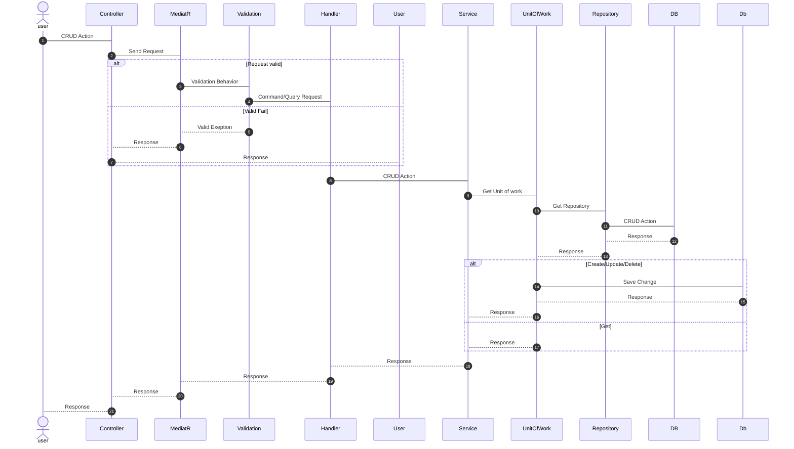

# Web API TaskDaily Project ( Clean Architeture )
##### Web API Manage daily tasks using CleanArchitecture, User can perform CRUD, GetAll, GetById... ##
## Tech Using
1. .NET 6
2. PostgreSQL
3. EF Core 
4. MediatR
5. FluentVaidation
6. Repositoy Pattern
7. Auto Mapper

# Overview
## 1.   Clean Architecture

Clean architecture is an architecture that designs software based on dependency rules.
## Project includes architectural layers
### * Domain 
Entities encapsulate Enterprise wide business rules. 
1. Enities 
2. Common
### * Infrastucture
Layer of interaction with DataBase
1. DbContext
2. Repository
3. EF Configuation
### * Application
Data processing layer, login business
1. Service
2. Handler
3. Interface
### * API
Layer receives requests and interacts with users

## 2. Controller   

| API Daily Task                               | Description                 | Reqeust Body           | Response Body      |
| :---                                         |    :----                    |   :---:                |  :----:            |
| Get /get-all-task?take={take}                | Get all Daily tasks         |  int take              | List of Daily Task |
| Get /get-task-by-id?id={id}                  | Get Daily tasks by id       |  int id                | Daily Task Response|
| Get /get-task-by-user-id?userId={userId}     | Get Daily tasks by userId   |  int userId            | List of Daily Task |
| Post /create-task                            | Create Daily task           |  TaskDailyDto          | Daily Task Response|
| Put /update-task?id={id}                     | Update Daily task           |  int id; TaskDailyDto  | Daily Task Response|
| Delete /delete-task?id=                      | Delete Daily task           |  int id                |Daily Task Response |

| API User                                     | Description                 | Reqeust Body           | Response Body      |
| :---                                         |    :----                    |   :---:                |  :----:            |
| Get /get-all-user?take={take}                | Get all user                |  int take              | List of User       |
| Get /get-user-by-id?id={id}                  | Get user by id              |  int id                | User Response      |
| Post /create-user                            | Create user                 |  UserDto               | User Response      |
| Put /update-user?id={id}                     | Update user                 |  int id; UserDto       | User Response      |
| Delete /delete-user?id=                      | Delete user                 |  int id                | User Response      |

### 2. To Use
#### 1. Prerequisites 
    - Visual Studio
    - PostgreSQL
    - Chrome
    - .Net 6 SDK
#### 2. Change connection String In appseting.json
     
          "Server=localhost;Database=Test1;Username=USER_NAME;Password=PASS_WORD"
#### 3. Update DataBase
# Document
### 1. Sequence Diagram 

