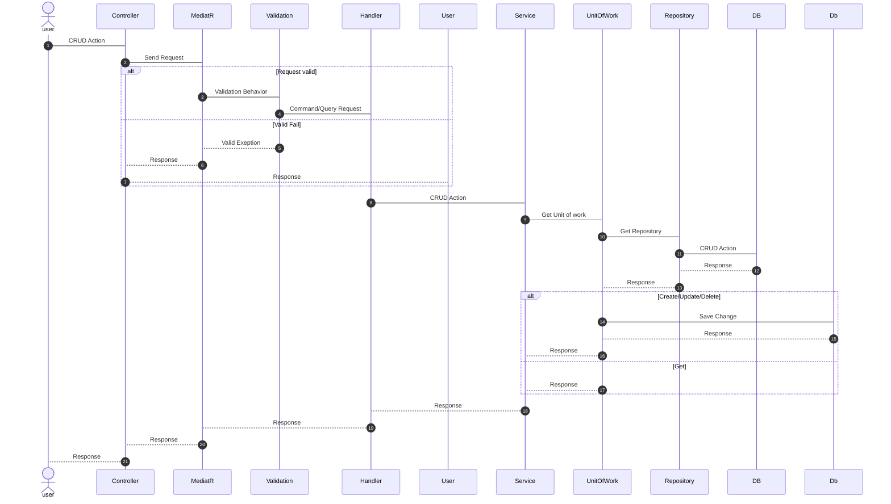

# Web API TaskDaily Project ( Clean Architeture )
## Tech Using
1. .NET 6
2. PostgreSQL
3. EF Core 
4. MediatR
5. FluentVaidation
6. Auto Mapper

### 1. Introduction
### 2. To Use
#### 1. Require 
    - Visual Studio
    - PostgreSQL
    - Chrome
    - .Net 6
#### 2. Change connection String In appseting.json
    - 
          "Server=localhost;Database=Test1;Username=USER_NAME;Password=PASS_WORD"
#### 3. Update DataBase
# Document
### 1. Sequence Diagram 

# Over View (CLean Architecture)

### Domain
Entities encapsulate Enterprise wide business rules. 
### Infrastucture
Layer of interaction with DataBase
### Application
Data processing layer, login business
### API
Layer receives requests and interacts with users
